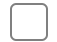
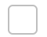

# HTML-elements-with-Web-Components
Some HTML input elements appear differently across browsers. The elements defined in this repo ensure your design remains consistent across all of them. These elements are made with Web Components. 

## Table of Contents
- [`<custom-checkbox>`](#custom-checkbox)

## `<custom-checkbox>`

|  |  |  |  |
|:---------------:|:---------------:|:---------------:|:---------------:|
| Unchecked       | Checked       | Unchecked & Disabled      | Checked & Disabled       |

### How to use
Include this in the `<head>` section of your HTML file:
```html
	<script defer src="https://taurbalaur.github.io/HTML-elements-with-Web-Components/custom-checkbox/custom-checkbox-script.min.js"></script>
```
Attributes: `checked`, `disabled`

### NOTES!
- the checkbox is 30x30 px by default;
- to change the size of the checkbox you need to set the `width` property;
- the checkbox is and `inline-grid` element.

Examples:
```html
	<custom-checkbox></custom-checkbox>
	<custom-checkbox style="width: 50px;"></custom-checkbox>
	<custom-checkbox checked disabled></custom-checkbox>
```
